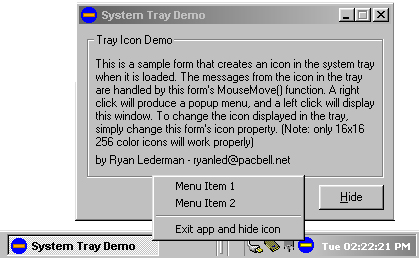



## System Tray Icon Demo

### Description

Creates a system tray icon for your application with a popup menu and other functionality.
 
### More Info
 
To change the icon displayed in the tray, change the Icon property of frmMain. This is the image used to initialize the tray icon. The message handling for the tray icon is done in frmMain_MouseMove(). There is a select case call there that decides which windows message (WM_) the icon received. You can display a popup menu, show your form, maximize, minimize, etc...

             |
---                |---
**Submitted On**   |2000-05-30 14:19:48
**By**             |[One Light, Inc\.](https://github.com/Planet-Source-Code/PSCIndex/blob/master/ByAuthor/one-light-inc.md)
**Level**          |Intermediate
**User Rating**    |4.8 (24 globes from 5 users)
**Compatibility**  |VB 5\.0, VB 6\.0
**Category**       |[Custom Controls/ Forms/  Menus](https://github.com/Planet-Source-Code/PSCIndex/blob/master/ByCategory/custom-controls-forms-menus__1-4.md)
**World**          |[Visual Basic](https://github.com/Planet-Source-Code/PSCIndex/blob/master/ByWorld/visual-basic.md)
**Archive File**   |[CODE\_UPLOAD62435302000\.zip](https://github.com/Planet-Source-Code/one-light-inc-system-tray-icon-demo__1-8472/archive/master.zip)

